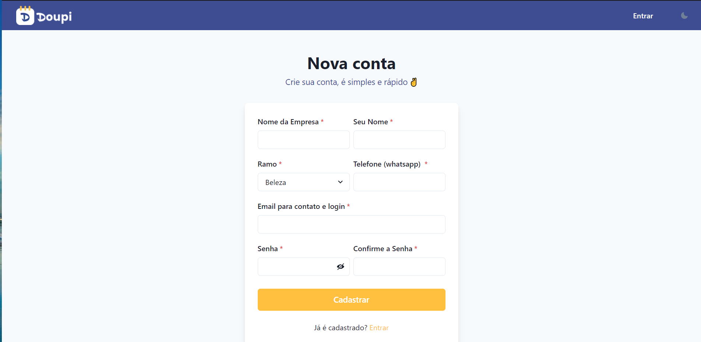
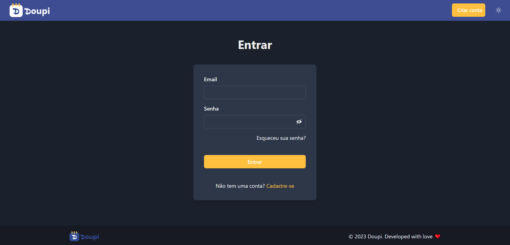
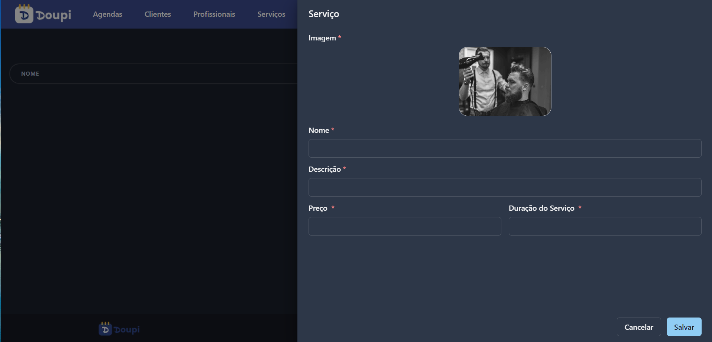
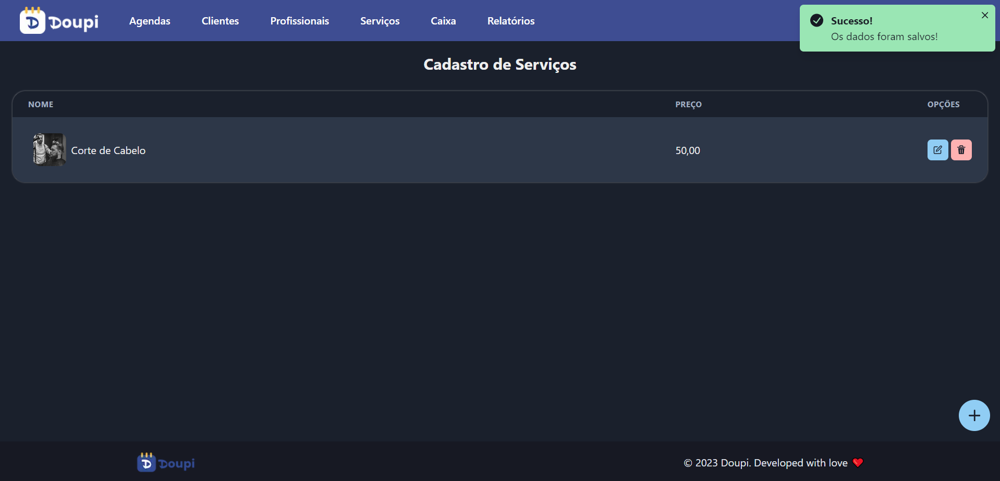
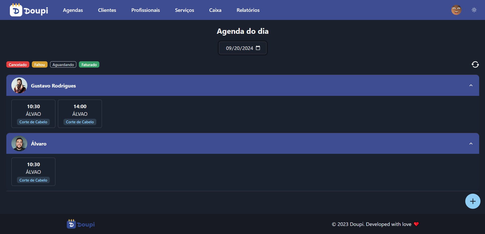
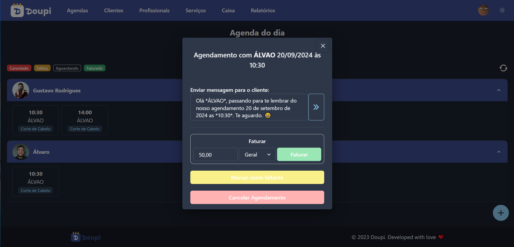
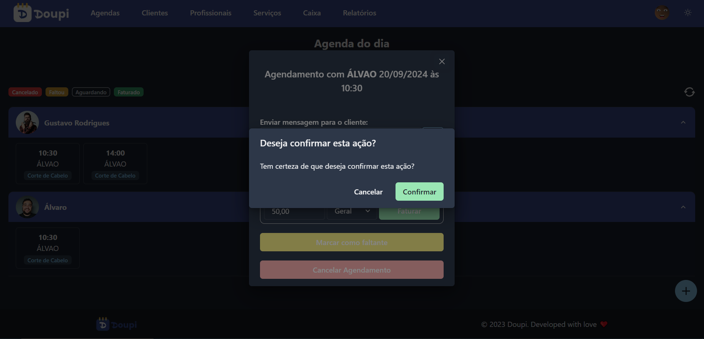
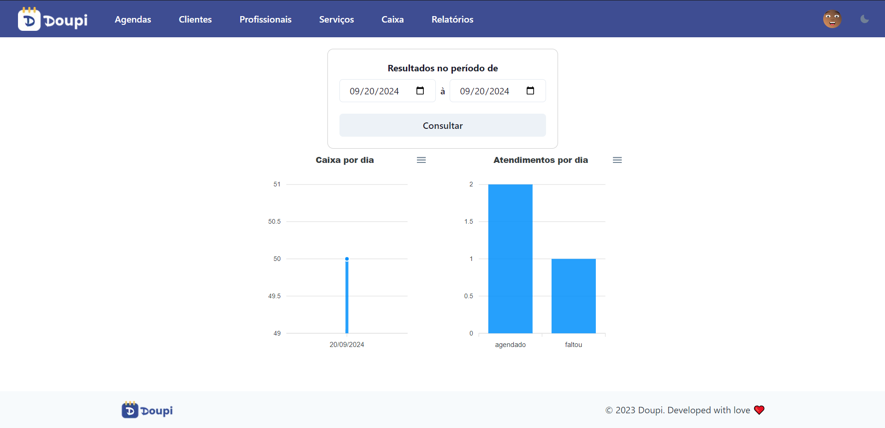
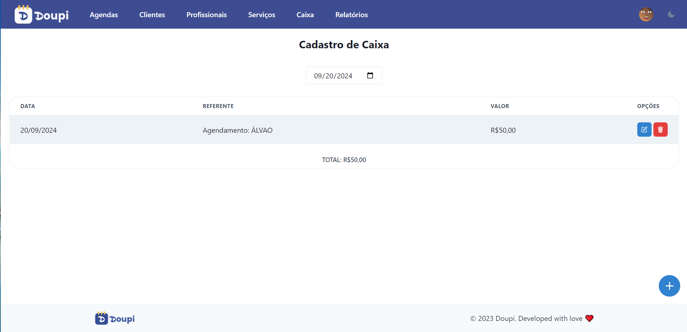

# Doupi

CRM for service companies that manage appointment scheduling.

## Technologies

- **Monolith**: Next.js
- **Database**: MongoDB

## Installation

1. Clone the repository:

   ```bash
   git clone https://github.com/alvarojfjunior/doupi.git

   ```

2. Install dependencies:

   ```bash
   npm i

   ```

3. Execute in dev environment:
   ```bash
   npm run dev
   ```

## Screenshots


<!-- 










 -->
